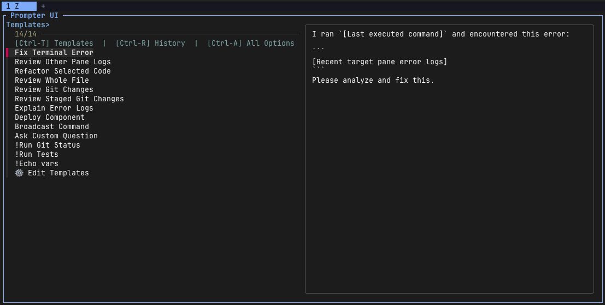

# Mux Prompter

<p align="center">
  
</p>

<p align="center">
  <b>Fuzzy-pick and inject context-aware prompts into active Herdr and tmux panes.</b>
</p>

---

**Mux Prompter** is a prompt productivity plugin for terminal multiplexers ([Herdr](https://herdr.dev) and [tmux](https://github.com/tmux/tmux)). It allows you to instantly pick and inject reusable prompt templates into your active terminal pane with a single keyboard shortcut.

Additionally, it can automatically resolve context placeholders—such as error logs, git diffs, file contents, and selected code—eliminating the hassle of manual copy-pasting when interacting with AI coding assistants.

By pressing a simple shortcut, a dynamic `fzf` UI pops up, allowing you to pick a prompt template. All context placeholders (if any) are **resolved automatically in real time**, and the finalized prompt is injected straight into your active terminal pane.

---

## ⚡ Quick Demo Flow

```text
[ Active Terminal Pane ]
  │
  ├── 1. Press shortcut (`prefix + P` / `Alt + p`) ──► [ Prompter UI (fzf) ]
  │                                                       ├── Templates> (Default)
  │                                                       ├── History>   (Ctrl-R)
  │                                                       └── All>       (Ctrl-A)
  │                                                              │
  │                                                       Select Template with Live Preview
  │                                                              │
  └── 2. Safe Injection ◄────────────────────────────────────────┘
        • Automatically resolves context placeholders and inserts prompt into buffer
        • Review and edit in terminal before submitting
```

---

## ✨ Key Features

- ⚡ **Instant Prompt Launcher**: Quickly pick and insert reusable prompt templates into your terminal buffer.
- 📁 **Markdown-Based Template Management**: Manage templates as clean, multiline `.md` files under `templates/` (supports subfolder categories).
- 🔍 **Interactive Fuzzy Picking**: Search templates using `fzf` with a side-by-side live resolved preview.
- 🤖 **Auto-Context Resolution**: Automatically gathers terminal logs, git diffs, branch names, file contents, and error tracebacks via `{{placeholders}}`.
- 🎯 **Interactive Inputs**: Interactively prompt for missing variables, choose target panes, or pick files on-the-fly.
- 📜 **Prompt History**: Automatically saves sent prompts so you can re-use previous prompts easily with `Ctrl-R`.

---

## 📦 Prerequisites

Ensure you have the following CLI tools installed:

- **`fzf`**: Command-line fuzzy finder.
- **`jq`**: Command-line JSON processor.
- *(Optional)* **`python3`**: Recommended for optimal string replacement performance (an automatic robust `awk` fallback is included if Python 3 is unavailable).

---

## 🚀 Installation & Setup

### 🟢 Herdr Setup

1. Install via Herdr CLI:
   ```bash
   herdr plugin install phine-apps/mux-prompter
   ```

2. Add keybinding to `~/.config/herdr/config.toml`:
   ```toml
   [[keys.command]]
   key = "prefix+P"
   type = "shell"
   command = "herdr plugin pane open --plugin github.phine-apps.mux-prompter --entrypoint picker"
   ```

---

### 🔲 tmux Setup & Plugin Distribution

Mux Prompter natively supports **TPM (Tmux Plugin Manager)** for one-line installation and distribution.

#### Option A: Install via TPM (Recommended)

Add to your `~/.tmux.conf`:

```tmux
set -g @plugin 'phine-apps/mux-prompter'
```

Then press `prefix` + `I` to fetch and install the plugin automatically!

*(Optional TPM Customizations in `~/.tmux.conf`)*:
```tmux
set -g @prompter-key 'P'       # Custom shortcut key (default: P)
set -g @prompter-width '80%'   # Custom popup width (default: 80%)
set -g @prompter-height '60%'  # Custom popup height (default: 60%)
```

---

#### Option B: Manual Installation

1. **Clone Repository**:
   ```bash
   git clone https://github.com/phine-apps/mux-prompter.git ~/apps/mux-prompter
   ```

2. **Add Keybinding to `~/.tmux.conf`**:
    ```tmux
    # Bind prefix + P (Shift+P) to open Mux Prompter in a popup window
    bind-key P display-popup -E -w 80% -h 60% "PROMPTER_CALLER_PANE='#{pane_id}' ~/apps/mux-prompter/prompter.sh"

    # Fallback for older tmux versions (< 3.2 without display-popup support):
    # bind-key P split-window -h -c "#{pane_current_path}" "PROMPTER_CALLER_PANE='#{pane_id}' ~/apps/mux-prompter/prompter.sh"
    ```

---

## 💡 How to Use

### Step 1: Open Prompter UI

Press your configured shortcut key (`prefix` + `P` in tmux, or shell shortcut). The `fzf` UI overlay will appear at the top.

### Step 2: Switch Views (Optional)

Use the keyboard shortcuts shown in the top header:

- **`Ctrl-T`**: Show Prompt Templates (Default)
- **`Ctrl-R`**: Show History of previously executed prompts
- **`Ctrl-A`**: Show All (Templates + History)

### Step 3: Select Template & Confirm

As you move your selection cursor, the right preview panel dynamically displays how placeholders (like `{{git_diff}}` or `{{error}}`) will be resolved.

Press **Enter** to confirm:

- The generated text is safely pasted into your active terminal pane so you can inspect, edit, or submit it as needed.

---

## 🧩 Supported Placeholders

You can use any of the following placeholders inside your prompt templates:

### 🐙 Git & Workspace Context

| Placeholder           | Description                          | Example Output          |
| :-------------------- | :----------------------------------- | :---------------------- |
| `{{git_diff}}`        | Full `git diff` of unstaged changes  | Diff of modified files  |
| `{{git_diff:staged}}` | `git diff` of staged changes only    | Diff of staged files    |
| `{{git_status}}`      | Concise git status (`git status -s`) | ` M src/main.rs`        |
| `{{git_branch}}`      | Current active git branch name       | `main` or `feature-xyz` |

### 🖥️ Terminal & Pane Context

| Placeholder            | Description                                          | Example Output                  |
| :--------------------- | :--------------------------------------------------- | :------------------------------ |
| `{{selected}}`         | Currently selected text/code block in Herdr          | _(Selected code block)_         |
| `{{pane_logs}}`        | Last 100 lines of scrollback buffer from active pane | Terminal output                 |
| `{{pane_logs:errors}}` | Extracts error/warning lines from last 100 lines     | `Error: Connection refused`     |
| `{{last_command}}`     | Automatically parses the last executed shell command | `npm test` or `cat > /dev/null` |
| `{{error}}`            | Scans scrollback logs for recent errors/exceptions   | Stacktrace or panic log         |

### 🎯 Interactive Inputs & Choosers

| Placeholder           | Description                          | Behavior                                                                    |
| :-------------------- | :----------------------------------- | :-------------------------------------------------------------------------- |
| `{{pane:choose}}`     | Pick another pane in your workspace  | `fzf` opens showing `Tab X \| Pane ID (dir)`. Imports log of selected pane. |
| `{{panes:choose}}`    | Pick multiple panes for broadcasting | Multi-select `fzf` list to target multiple panes.                           |
| `{{file}}`            | Pick a file from repository          | `fzf` opens to select a file. Injects **full contents** of the file.        |
| `{{file_path}}`       | Pick a file from repository          | `fzf` opens to select a file. Injects **relative path** of the file.        |
| `{{file:lines=1-20}}` | Truncate specific lines from a file  | Injects lines 1 to 20 from selected file.                                   |
| `{{input}}`           | Custom multi-line prompt input       | Prompts for manual input in terminal (Ctrl+D to finish).                    |
| `{{var:name}}`        | Interactive custom variable          | Prompts for value `name` (or shows `fzf` choices if generator is defined).  |

---

## 🛠️ Customization & Configuration

Templates are managed as individual Markdown files (`.md`) inside your plugin configuration directory:
`~/.config/mux-prompter/templates/` (or `~/.config/herdr/plugins/github.phine-apps.mux-prompter/templates/`)

```text
~/.config/mux-prompter/
├── templates/
│   ├── _vars.txt                    # Custom variable candidate generators
│   ├── fix-terminal-error.md
│   ├── refactor-selected-code.md
│   ├── review-git-changes.md
│   ├── summarize-discussion.md
│   └── git/                         # Subdirectories are automatically discovered
│       └── commit-helper.md
└── prompter_history.txt
```

### Template File Format (`.md`)

Each template file is a standard, clean Markdown document:

- **Title**: Defined by the first `# Heading` in the file. (If omitted, the file name without extension is used as the title.)
- **Body**: Everything following the heading line is the prompt body.

#### Example: `templates/fix-terminal-error.md`

```markdown
# Fix Terminal Error
I ran `{{last_command}}` and encountered this error:

```
{{error}}
```
Please analyze and fix this.
```

### Edit & Delete Templates via UI

Select **`🔧 Edit Templates`** from the `fzf` UI to:
- **`Enter`**: Open and edit the selected template file in your `$VISUAL` or `$EDITOR` (`nvim`, `vi`, `nano`, or editors with flags like `code --wait`).
- **`Ctrl-D`**: Delete the selected template file (with interactive `y/N` confirmation).
- **`➕ [Create New Template]`**: Create and name a new `.md` template on-the-fly.
- **`Esc`**: Return to the main template menu. Closing your editor also returns you to the main menu automatically.

### Custom Variable Candidate Generators (`$ name: command`)

You can define candidate command generators for custom variables (`{{var:name}}`) in `templates/_vars.txt` (or inside any template file):

```text
# Candidate generators ($ var_name: shell_command)
$ branch: git branch --format="%(refname:short)"
$ environment: echo -e "development\nstaging\nproduction"
```

When selecting a template containing `{{var:branch}}`, an `fzf` menu will automatically pop up with choices generated by `git branch`!

### Automatic Migration from Legacy `templates.txt`

If an existing single-file `templates.txt` is detected, Mux Prompter will **automatically convert** each line into its own `.md` file under `templates/`, migrate custom variables to `_vars.txt`, and safely back up the old file to `templates.txt.bak`.

---

## 🔀 Hybrid Multiplexer Support (Herdr & tmux)

Mux Prompter natively supports **[Herdr](https://herdr.dev)** and **[tmux](https://github.com/tmux/tmux)** multiplexers via a unified backend abstraction layer.

### Automatic Detection

By default, Mux Prompter automatically detects which terminal multiplexer environment is currently active:
- **`tmux`**: Detected when running inside a `tmux` session (`$TMUX` environment variable is set) or when `tmux` CLI responds.
- **`herdr`**: Detected when `$HERDR_PLUGIN_CONTEXT_JSON` is present or running as a Herdr plugin entrypoint.

### Environment Overrides

You can explicitly override the backend selection by setting the `MUX_BACKEND` environment variable:

```bash
export MUX_BACKEND="tmux"   # Force tmux backend
# or
export MUX_BACKEND="herdr"  # Force Herdr backend
```

| Variable | Description | Default |
| :--- | :--- | :--- |
| `MUX_BACKEND` | `auto`, `tmux`, or `herdr` | `auto` |
| `TMUX_BIN_PATH` | Custom path to `tmux` executable | `tmux` |
| `HERDR_BIN_PATH` | Custom path to `herdr` executable | `herdr` |
| `PROMPTER_CALLER_PANE` | Originating pane ID in tmux (passed automatically by TPM / popup binding) | Current pane |
| `PROMPTER_TARGET_PANE` | Explicitly targets a specific pane ID for prompt injection | Detected active pane |

---

## 📄 License

This project is licensed under the [MIT License](LICENSE).
